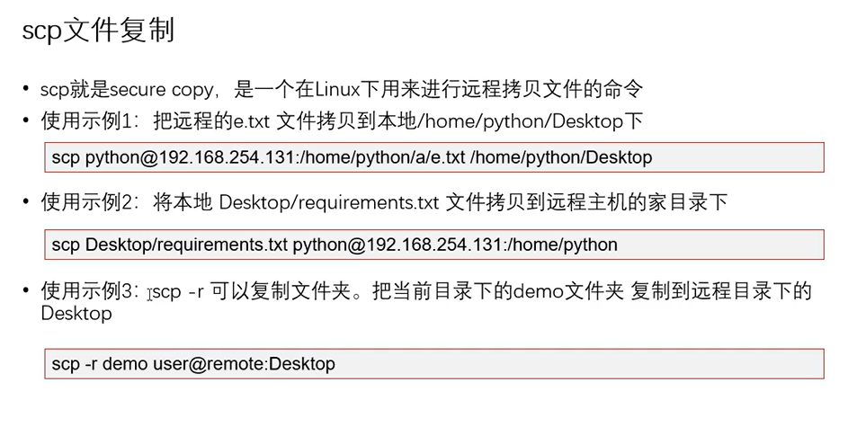

## 常用Linux命令的基本使用

> `小技巧`
>
> * ctrl+shift+=放大终端窗口的字体显示
> * ctrl+ - 缩小终端窗口的字体显示

### 01.常用Linux基本命令

| 命令             | 对应英文                 | 作用                         |
| ---------------- | ------------------------ | ---------------------------- |
| **li**           | **list**                 | **查看当前文件夹下的内容**   |
| **pwd**          | **print work directory** | **查看当前所在文件夹**       |
| **cd 目录名**    | **change directory**     | **切换文件夹**               |
| **mkdir 目录名** | **make directory**       | **创建目录**                 |
| **touch 文件名** | **touch**                | **如果文件不存在，则新创建** |
| **rm 文件名**    | **remove**               | **删除指定的文件名**         |
| **clear**        | **clear**                | **清屏**                     |

## Linux终端命令格式

### 01终端命令格式

```bash
command [-options] [parameter]
```

说明：

* `command`:命令名
* `[-options]:`选项，可用来对命令进行控制，可以**省略**
* `parameter`:传递给命令参数 ，可以是**零个，一个，或者多个**

> `[]` 代表可选

### 02查阅命令帮助信息

#### **2.1 --help**

说明：

* 显示 `command` 的命令的帮助信息

```bash
command --help
```


#### 2.2 man

说明：

* 查阅 `command` 命令使用手册

```bash
man command
```


| 快捷键 |   功能说明   |
| :----: | :----------: |
|   q    | 退出使用手册 |
|   ↑    |  向上翻一行  |
|   ↓    |  向下翻一行  |
|  Pgup  |  向上翻一页  |
|  Pgdn  |  向下翻一页  |

## 文件和目录常用命令

### 01. ls查看目录文件

| 选项 | 含义                           |
| ---- | ------------------------------ |
| -a   | 显示隐藏文件                   |
| -l   | 以列表的形式显示               |
| -h   | 以人性化的方式显示文件内容大小 |
| -R   | 递归显示子目录                 |

### 02. cd 切换工作路径

**绝对路径**：

> 指的是在输入路径时，最前面是/或者~表示从 根目录/家目录开始的具体目录位置

**相对路径**：

> 指的是以当前目录开始，不以/或者 ~开头，表示不是根目录或家目录开始的目录

| 命令     | 含义                           |
| -------- | ------------------------------ |
| cd       | 命令可以改变相对路径和绝对路径 |
| cd[路径] | 切换到指定路径                 |
| cd ~     | 切换到家目录                   |
| cd .     | 切换到当前目录                 |
| cd ..    | 切换到上一级目录               |
| cd -     | 上一次工作目录切换             |

### 03.创建和删除操作

#### 3.1touch创建文件

* 创建文件或修改文件日期

  * 如果文件**不存在**可以创建一个空白文件
  * 如果文件**已经存在**，可修改文件的末次修改日期.

```bash
touch 文件名
touch 文件名 文件名   touch 可以同时新建多个
sudo touch 文件名 
```


#### 3.2mkdir新建目录

```bash
* sudo mkdir PythonDir
* sudo mkdir -p a/b/c/d 递归创建
```

#### 3.3rmdir删除目录

```bash
-p 递归删除，只能删除空目录，非空目录无法删除
sudo rmdir 文件名 
```

#### 3.4rm删除文件或目录

| 选项 | 含义                                           |
| ---- | ---------------------------------------------- |
| -r   | 递归删除目录下的内容，删除文件夹时必须加此参数 |
| -f   | 强制删除，忽略不存在文件，无需提示             |

### 04拷贝和移动文件

#### **4.0 tree**

* 可以以树状图列出文件目录的结构

| 选项 | 含义       |
| ---- | ---------- |
| -d   | 只显示目录 |

#### 4.1 mv 移动和重命名 :

* mv命令在同一个文件夹移动文件，即重命名功能
* 格式：` mv 原文件路径 目标路径`

| 选项 | 含义                 |
| ---- | -------------------- |
| -f   | 覆盖前不询问         |
| -i   | 覆盖前询问           |
| -n   | 不覆盖已经存在的文件 |

#### 4.2. cp复制

| 选项 | 含义                                                         |
| ---- | ------------------------------------------------------------ |
| -i   | 覆盖前提示                                                   |
| -r   | 若给出的源文件是目录文件，则cp将递归复制该目录下的所有子目录文件，目标文件必须为一个目录名 cp src des 如果是复制文件夹，则加上-r 选项 |

### 05文件内容命令.

#### 5.1. cat 查看文件内容，合并文件

* `cat`命令可以用来**查看文件内容**，**创建文件**，**文件合并，追加文件内容**等
* `cat`会一次显示所有内容，适合**查看内容少的文本本件**

| 选项 | 含义               |
| ---- | ------------------ |
| -b   | 对非空输出行编号   |
| -n   | 对输出的所有行编号 |

#### 5.2. more 查看文件内容（分页查看）

> more filename  查看filename 文件的内容

可以**分屏显示**文件內容，每次只显示一頁內容，適用於 **查看內容較多** 的文本文件

| 快捷键  |   功能说明   |
| :-----: | :----------: |
|    q    |     退出     |
|    f    |  前滚一屏幕  |
|    b    |  回滚一屏幕  |
| 空格键  |  显示下一屏  |
| enter键 | 一次滚动一行 |

#### 5.3 grep

* Linux系统中 `grep`命令是一种强大的文本搜索工具
* `grep`允许对文本文件进行**模式查找，**所谓模式查找，又被成为正则表达式，

> 强大的文本搜索工具，能使用正则搜索文本，并把匹配的行打印出来

* -E 选项使用正则表达

> grep -E "[A-Z]+"  filename
> grep -E "[0-9a-z]" file_1 file_2 file_3...

* 输出包含匹配字符串的行数 -n选项
* 统计文件或者文本中包含匹配字符串的行数 -c选项

| 选项 | 含义                                     |
| ---- | ---------------------------------------- |
| -n   | 显示匹配行及行号                         |
| -v   | 显示不包括匹配文本的所有行（相当于求反） |
| -i   | 忽略大小写                               |

* 常用 的两种模式查找

| 参数 | 含义                   |
| ---- | ---------------------- |
| ^a   | 行首，搜寻以a开头的行  |
| ke$  | 行尾，搜寻以ke结束的行 |

## 其他命令

#### 01history 查看历史命令

> history 查看历史命令
> history -c 删除历史命令记录

#### 02sudo获得root权限 😯

> ubuntu默认是不能以root账号登陆系统，那么遇到需要root权限时，只需要在命令前面加上sudo 就可以获得ro

#### 03 echo 文字内容

* `echo` 会在终端中显示参数指定的文字，通常会和**重定向**联合使用

```bash
echo hello
```

#### 04重定向 > 和>>

* Linux允许将命令执行结果**重定向**到一个**问价**
* 将本应显示在**终端**上的内容 **输出/追加**到指定文件中

  其中
* `>`表示输出，回覆盖文件原有的内容
* `>>` 表示追加，会将内容追加到已有文件的末尾

  > **ll >> text.txt #将ll命令的输出**追加**到test.txt**
  >

  > echo HelloPython > a
  >

#### 05管道符 |

* Linux允许将**一个命令的输出** 可以**通过管道** 作为**另一个命令的输入**

> 将左边的输出当做右边的输入
>
> ls -lha ~ | more

常用的管道命令有：

* `more` 分屏显示内容
* `grep` 在命令执行结果的基础上查询指定文本

## 远程管理常用命令

### 01关机/重启

| 命令               | 对应英文 | 作用      |
| ------------------ | -------- | --------- |
| shutdown 选项 时间 | shutdown | 关机/重启 |

#### 1.1 shutdown

* `shutdown` 命令可以**安全 关闭** 或者**重启系统**

| 选项 | 含义     |
| ---- | -------- |
| -r   | 重新启动 |

* 不指定选项和参数，默认表示1分钟后关闭电脑
* 远程维护服务器时，最好不要关闭系统，而应该重启系统

**常用命令实例**

```bash

#重新启动操作系统，其中now 表示现在
shutdown -r now

#立即关机  其中now表示现在
shutdown now

#系统会在今天的20:25会关机
shutdown 20:25

#系统十分钟后自动关机
shutdown +10

#取消之前的指定的关机计划  cancel取消
shutdown -c  
```


### 02查看或配置网卡信息

| 命令         | 作用                              |
| ------------ | --------------------------------- |
| ping  ip地址 | 检测到目标ip地址的连接是否正常    |
| ifconfig     | 查看/配置计算机当前的网卡配置信息 |

#### 2.1 ifconfig 查看系统IP地址

> 一台计算机i中可能会有一个或物理网卡，和多个虚拟网卡，在Linux中，物理网卡的名字通常以 `ensXX `表示··

* `127.0.0.1`本地回环/环回地址，一般测试本机网卡是否正常

```bash
#查看网卡配置信息
ifconfig
#查看网卡对应的IP地址
ifconfig | grep inet
```


#### 2.2 ping

**ping命令 检查网络是否正常通信，Linux下默认ping不会结束，使用ctrl+c强制结束****

**示例** ：ping www.baidu.com

```bash
#检测到目标主机是否连接正常
ping IP地址

#检测本地网卡工作正常
ping 127.0.0.1
```

| col1 | col2                           |
| ---- | ------------------------------ |
| -c   | 指定ping几个数据包结束         |
| -i   | 指定发送数据包的间隔，单位是秒 |
| -s   | 指定发送数据的大小，单位字节   |
| -t   | 设置TTL的大小，TTL网络调数大小 |

### 03远程登陆和复制文件

| 命令                                              | 对应英文     | 作用          |
| ------------------------------------------------- | ------------ | ------------- |
| ssh 用户名@IP                                     | secure shell | 关机/重新启动 |
| scp 用户名@ip:文件名或路径 用户名@ip:文件名或路径 | secure copy  | 远程复制文件  |

#### **3.1ssh基础**

在Linux中SSH是非**常常用的**工具，通过**SSH客户端**可以连接到运行了**SSH服务器**的远程机器上


* SSH客户端是一种使用`Secure Shell (SSH)`协议连接到远程计算机的软件程序
* `SSH`是目前较可靠、**专为远程登录会话和其他网络的服务**，提供安全性的协议

* 利用`ssh 协议`可以有效的**防止远程管理过程中的信息泄漏**
* 通过`ssh 协议`可以对所有**传输的数据进行加密，也能够防止DNS欺骗和IP欺骗**
* `ssh `的另一项优点是传输的数据可以是**经过压缩的，所以可以加快传输速度**

**(1)域名和端口号**

**域名**

* 由一串**用点分隔**的名字组成，例如：`www.itcast.cn`
* 是**IP地址的别名**，方便用户记忆

**端口号**

* **IP地址**：通过**IP地址**找到网络上的**计算机**

* **端口号**：通过端口号可以找到**计算机上运行的应用程序**

  * **SSH服务器**的端口号默认是`22`,如果是默认端口，在连接时，可以省略。

* 常见服务端口列表：
  |      服务       | 端口号          |
  | :-------------: | --------------- |
  | **SSH 服务器**  | **22**          |
  |  **Web服务器**  | **80**          |
  | **HTTPS服务器** | **443**         |
  |  **FTP服务器**  | **21****（2）** |

（**2）SSH客户端的简单使用**

```bash
ssh [-p port] user@remote
```

* `user` 是在远程机器上的用户名，如果不指定的话默认是当前用户
* `remote` 是远程机器的地址，可以是**IP/域名**，或者是**后面会提到的别名**
* `port` 是**SSH Server监听的端口**，如果不指定，就默认值`22`

>**提示**：
>
>* 使用`exit`退出当前用户的登录
>
>**注意**：
>
>* `ssh`这个终端命令只可以在`Linux`或者`UNIX` 系统下使用
>* 如果在`Windowns`系统中，可以安装`PuTTY`和`XShell`客户端软件即可


* SSH是一种网络协议，用于计算机之间的加密登录，L**inux下默认开启sshd服务，只有开启sshd服务才能进行ssh连接**

* 可以使用 **service sshd status** 查看是否开启sshd服务， active(running)表示已经开启

* 没有开启可以 sudo apt-get install openssh-server

  


### （三）权限管理和远程管理

#### 1. 用户和用户组

用户：登录Linux必须要有账户，一台linux系统可以有多个用户，并且每个用户可有不同权限，在linux中指定用户对不同文件。目录拥有不同权限
用户组：LInux有一个组的概念，不同的用户分到一个组，那么同组下的用户可以用这个组的权限
权限：
linux权限有三种 读 写 执行那个

##### 2. **用户管理**

用户管理包括：创建用户，删除用户，修改用户帐号属性，创建用户组，修改用户组属性
其中，创建用户/删除用户/修改其他用户密码的终端命令斗需要sudo执行
**创建用户**

* 命令 ；useradd 「用户名」
* 选项说明：
  * -d指定新账户的主目录
  * -g 指定用户的所属组
  * -G指定用户附加组
  * -s指定用户登录shell
  * -m自动创建家目录

**删除用户**

* 命令：userdel 「用户名]
  * -r删除用户的同时删除家目录

**修改帐号属性**

* 命令：usermod
  * -u 用户id
  * -g 所属组id
  * -a -G GID：不适用-a选项，会覆盖此前的附加组
  * -d -m将家目录内容移动至新位置
  * -l新的登录名称
  * -s该用户帐号的新登录

**用户切换**

- su -「用户名」加-同时切换到用户的家目录，不加直接在当前目录切换到新用户

##### 3. 用户组管理

**创建用户组**

* 命令：groupadd

**删除用户组**

* 命令：groupdel

**修改组属性**

* 命令：groupmod
  * -g Gid

**小提示：：：：**

* 创建用户时，会默认创建一个与用户名同名 的组名
* 创建成功后可在/etc/passwd文件下查看
* 新创建的用户没用sudo权限，需要将用户加到adm sudo这两个组中才用有sudo权限

### （四）权限管理

* 命令：chmod +/- rwx 文件名|目录名 +增加权限 -取消权限
* 每个文件，都有三组不同的权限，第一组文件所有者，第二组文件所属组 ，第三组是其他用户

  * 1. u 文件所有者修改所有者权限，chmod u+/-/=rwx filename
  * 2. g 文件所有组 修改所属组权限： chmod g+/-/=rwx filename
  * 3. o 其他用户 修改所属组权限： chmod o+/-/=rwx filename
* 命令：chmod 755 文件名| 目录名 指定权限修改
* chmod 中第一个数字是代表所有者权限，第二个数字代表所属组权限，第三个数字代表其他人权限

| 权限 | 数字表示法 |
| :--: | :--------: |
|  r   |     4      |
|  w   |     2      |
|  e   |     1      |

**例题**

> 将a.text文件权限修改为 其他人无任何权限，所有者可读可写，所属组只可读
> chmod u=rw  g=w o=--- a.text
> 修改a.text文件所属组的权限为只读
> chmod g=r a.text



### （五）系统命令

> date df du uname top ps kill

**date** 查看系统当前时间

**查看磁盘的空间**

* df -TH 查看磁盘分区，以及挂载情况
* du -sh [目录名] 查看目录大小
* du -h [文件名] 查看文件大小

#### 查看内核/操作系统/CPU信息

* uname -a 查看内核/操作系统/CPU信息
* uname -i 查看硬件平台
* uname -m查看CPU
* uname -n节点名称
* uname -o操作系统
* uname -v 内核版本
* uname -r 发行版本号

#### 查看进程

* top 查看进程实时运行情况，即系统资源实时使用情况 退出top界面输入q

#### 查看进程

* ps 查看系统所有进程状态
* 命令： ps -ajx 一般使用ps命令带选项ajx一起使用  -aux

| 符号 |           状态           |
| :--: | :----------------------: |
|  D   |     不可中断系统进程     |
|  R   |       运行中的进程       |
|  S   |      中断Sleep状态       |
|  T   |           停止           |
|  Z   | 僵死，一般称之为僵尸进程 |

#### 结束进程

* 命令：kill [参数] [进程号]
  * kill -9[进程号] ：强制结束进程
  * kill -15[进程号]：结束进程，等级没有-9高
* 提示：
  * 在Linux中1号进程（init进程）是有所有进程的祖先进程，是不能被结束的

### （六）文件查找命令

**which命令**

> 查找并显示给定定命令的绝对路径
> which [系统命令]

**whereis命令**

> 查找到命令的绝对路径

**locate命令**

> locate [搜索关键字]
> 安装
> sudo apt update
> sudo apt install plocate

**find命令**

> find [搜索路径] [搜索选项] filename

### （八）文件解压打包

#### 文件打包

> **打包**：tar -cvf 打包的文件名.tar 被打包的文件/路径
> ==-c== 创建一个新的归档
> ==-v== 详细地列出处理的文件
> ==-f== 使用归档文件

#### 文件解包

> tar -xvf 打包文件.tra -C 指定路径
> ==-x==将打包过的文件解包
> 提示：-f必须放在最后

#### gzip命令

gzip一般跟tar一起使用，完成打包压缩
tar只负责打包并为做压缩，使用 **-z** 选项可以调用gzip压缩，完成打包压缩
使用tar打包压缩的文件名，一般命名为xxx.tay.gz区别与其他文件
**压缩文件**

> tar -zcvf py.tar.gz a.txt b.txt c.txt

**解压缩文件**

> tar -zxvf py.tar.gz
> 解压缩到指定路径
> tar -zxvf 打包文件.tar.gz -C 目标路径
> ==-C== 指定解压到哪里，解压的目录必须存在

#### bzip2命令

> **压缩文件**：tar -jcvf py.tar.bz2 a.txt b.txt
> bzip2使用方式跟gzip差不多，也是由tar去调用，使用 **-j**选项
> bzip2压缩的文件命名采用 xxx.tar.bz2

### （九）ubuntu软件管理

**软件安装**

> sudo apt install [软件包]
> 如： sudo apt install ssh

**软件更新**

> sudo apt upgrade [软件包] #如果没有软件包将会更新所有已经安装的软件
> 如：sudo apt upgrade ssh

**软件卸载**

> sudo apt remove [软件包]
> 如；sudo apt remove ssh

### （十）vim编辑器

**vim三种模式：**

* 命令模式
* 插入模式
* 末行模式

##### 1. 命令模式

使用vim打开文件的时候，就是进到命令模式。
vim filename：打开或者新建文件，并将光标置于第一行首
vim+n filename：打开文件，并将光标置于第n 行首
vim + filename:打开文件，并将光标置于最后一行首
vim +/pattern filename :打开文件，并将光标置于第一个与pattern匹配的串处
vim -r filename： 在上次正用vim编辑时发生系统崩溃，恢复filename
vim filename.....filename:打开多个文件，依次进行编辑

进去后 想写东西按==i==进入插入模式  ，写完后按==ESC==  按住Shift + ： 输入wq/x 保存

#### 删除复制命令

#### 进入输入模式

插入文本类命令：

* i:在光标前
* I:在当前行首
* a:光标后
* A:在当前行尾
* o:在当前行之下新开一行
* O:在当前行之上新开一行

| 快捷键  |   功能说明   |
| :-----: | :----------: |
|    q    |     退出     |
|    f    |  前滚一屏幕  |
|    b    |  回滚一屏幕  |
| 空格键  |  显示下一屏  |
| enter键 | 一次滚动一行 |


